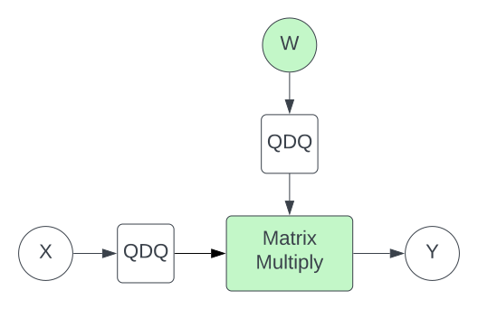

As Transformer models increase in size, the computational cost of running inference also grows. Many organisations now face the challenge of deploying state-of-the-art models in a cost-effective way.

One popular technique for doing so is **quantization** - by reducing the precision of network parameters and activations, quantization aims to **increase throughput** and **decrease memory footprint**. 

Of course, this is useless if quantizing to lower precision harms model accuracy. The first part of this blog introduces the quantization formulation, and explores techniques for minimising such degradations.

Reducing peak memory by quantizing from FP16 to INT8 is pretty much guaranteed. However, *achieving throughput improvements is more difficult*. The main challenge stems from overheads associated with the quantization/dequantization operations, which can mask performance gains from the blazingly fast INT8 [Tensor Core](https://www.nvidia.com/en-gb/data-center/tensor-cores/#:~:text=Tensor%20Cores%20enable%20mixed%2Dprecision,performance%20computing%20(HPC)%20tasks.) matrix multiplies. The second part of this blog explores the nuances around achieving peak performance on GPU.

* [Part I: Accurate Quantization](#Part%20I:%20Accurate%20Quantization)
	* [The Quantization Equation](#The%20Quantization%20Equation)
	* [Dynamic vs Static Quantization](#Dynamic%20vs%20Static%20Quantization)
	* [Calibration](#Calibration)
	* [Quantization Granularity](#Quantization%20Granularity)
	* [Specifics of INT8 GEMMs](#Specifics%20of%20INT8%20GEMMs)
		* [i8i32](#i8i32)
		* [i8i8](#i8i8)
	* [Quantization-Aware Training](#Quantization-Aware%20Training)
	* [SmoothQuant](#SmoothQuant)
* [Part II: Fast GPU Quantization in Practice](#Part%20II:%20Fast%20GPU%20Quantization%20in%20Practice)
	* [Available Solutions](#Available%20Solutions)
		* [TensorRT](#TensorRT)
		* [FasterTransformer](#FasterTransformer)
	* [Memory Layouts](#Memory%20Layouts)
	* [Operator Fusion Implementation](#Operator%20Fusion%20Implementation)
	* [INT8 GEMM Benchmarking](#INT8%20GEMM%20Benchmarking)
		* [INT8 vs INT32 output precision](#INT8%20vs%20INT32%20output%20precision)
		* [FP16 output precision](#FP16%20output%20precision)
		* [Memory layout](#Memory%20layout)
	* [The Future of 8-bit Quantization - FP8](#The%20Future%20of%208-bit%20Quantization%20-%20FP8)
		* [Data distribution alignment](#Data%20distribution%20alignment)
		* [FP8 Training](#FP8%20Training)
		* [cuBLASLt API](#cuBLASLt%20API)
	* [References](#References)


> [! TODO]
> Add references.

# Part I: Accurate Quantization

We’ll begin with a quick overview of quantization. For deeper reading on this subject, some nice blogs/papers in the [References](#References) section [1-4].

### The Quantization Equation

In principle, we can use any function to convert from a higher-precision to lower-precision representation. But a linear function is simplest and quickest [4]:

$$Q(x)=\textrm{Int}(x/S)-Z$$ 

Here, $Q$ and $x$ are the fixed-point output and floating-point input, while $S$ and $Z$ represent the scale factor and bias. $\textrm{Int}$ is a function that rounds to the nearest integer, clipping values outside of the representable range. 

After applying our lower-precision operation we return the data to it's original dynamic range with dequantization: 

$$\tilde{x}=S Q(x) + Z$$

This method is called **uniform quantization** since the quantized values are uniformly distributed over the input space. To calculate $S$ we select a **clipping range** $[\alpha, \beta]$ and then use:

$$S=\frac{\beta-\alpha}{2^b-1}$$

Here, $b$ is the number of bits in our quantization scheme. GPU based quantization schemes typically enforce $\alpha=-\beta$, which is known as **symmetric quantization**. This simplifies the (de)quantization functions by setting $Z=0$, which helps reduce the cost of the transformation [4](https://arxiv.org/pdf/2103.13630.pdf).

It's important to note that the rounding function in Equation (1) incurs a loss of information. In general, $\tilde{x}=SQ(x)\not = x$.  The value $\tilde{x}-x$ is called **quantization error**. 


### Dynamic vs Static Quantization
A key question is how to determine the clipping range - determined by $\beta$. Too small, and we’ll excessively “truncate” outlier activations and weights. Too big, and we’ll lose precision.

While model parameters can always be quantized offline, its activations can either be quantized **dynamically** (with the clipping range calculated for each activation during a forward pass) or **statically** (also offline). 

Dynamic quantization tends to be more accurate but requires additional computational overhead for online scalar calibration. As a result, **we only consider static quantization on GPU** because the scalar reduction (relative to an INT8 matmul) can be costly and limit performance gains.

### Calibration

Static quantization involves obtaining activation quantization parameters by passing several batches of data through the model to measure activation distribution. This process is called **calibration**. 

There are multiple methods to derive a clipping range from these activations, such as:

* Taking the min/max value from the calibration data
* Minimising KL Divergence between the input and quantized distributions
* Minimising the Mean-Squared Error between input and quantized distributions

To perform calibration, we used TensorRT’s PyTorch Quantization Toolkit [5]. Another option is to use the `QuantStub` and `DeQuantStub` nodes from [PyTorch](https://pytorch.org/docs/stable/quantization.html) directly, to capture the relevant statistics.


### Quantization Granularity 

> [!TODO]
> {MOVE INTO SMOOTHQUANT SECTION OR JUST BEFORE}

A final distinction to be made is how we quantization parameters are shared between elements of our parameters and activations. Throughout this blog, we'll use the following diagram to illustrate a matmul:


The simplest approach is to use the same scale factor for all elements of $W$ (and likewise for $X$). This is known as **per-tensor** quantization.

It’s also feasible to share quantization parameters between some subgroups of each input matrix. A popular option is to assign a specific scale factor to each column of $W$, referred to as **per-channel (or per-column) quantization**. This is more accurate than per-tensor quantization; using a specific scale means the error incurred in quantizing each column is lower. 


## Specifics of  INT8 GEMMs

The core element of a quantized neural network is INT8 matrix multiplication. Understanding its details is crucial for an efficient implementation. This section describes these details, and serves as context for [Part II](Part II: Fast GPU Quantization in Practice) of the blog.

We identify two types of INT8 matmul, differentiated by their return type.

#### i8i32
Consider the following matrix multiplication:

$$Y=WX$$

where $X\in \mathbb{R}^{N \times d}$, $W\in \mathbb{R}^{d \times d}$, $Y\in \mathbb{R}^{N \times d}$  are the input, weight, and output  tensors respectively. We omit a bias for simplicity. Consider the case where all tensors are **Floating Point**, but the matrix multiply runs in INT8. An INT8 in INT32 out (i8i32) matrix multiplication is implemented as follows:

%201.svg)

The arrows indicate a data transfer with dtype given by their colour. The square boxes indicate operations, with dtype of the return variable also given by their colour.

There are several points to note:

* The input $X$ first passes through a quantization operation, labelled Q. This performs the operation described in Equation (1).
* Our weights $W$ can be quantized offline. 
* The accumulated output of the Matmul has **INT32** dtype. This is because multiplication of two signed INT8 numbers can be represented in INT16. Since a matmul involves the addition of several INT16 values, the accumulator must have dtype INT32 to prevent overflow.
* The output is passed through a dequantization op, labelled DQ. This performs the operation described in Equation (2), and returns in FP16.

#### i8i8
Returning in INT8 involves an extra step:


In this **requantization** step, labelled RQ, we convert the INT32 representation back into INT8. {TALK ABOUT HOW RQ is DERIVED). The benefit is a reduction in the amount of data written from GPU SRAM to DRAM - and so higher performance.

#### Quantization Operation Overheads

> [!TODO]
> MOVE TO BENCHMARKING SECTION?

To fully realise the throughput improvements from INT8 matrix multiplications, we must mitigate the cost of the Q/DQ/RQ nodes. Since these are elementwise operations, this can be achieved through [operator fusion](https://horace.io/brrr_intro.html). 
The following diagrams demonstrate this for i8i32 and i8i8. Fused operators are indicated by the dashed boxes:

.svg)

.svg)

In both cases, the Q node can sometimes be fused with a preceding operation, in this case a layernorm. 
In i8i32, we see the DQ is fused with the matrix multiply itself. This ensures the dtype of the tensor that's transferred between SRAM and DRAM is FP16 instead of INT32.
In i8i8, we see the RQ is fused with the matmul. This ensures an INT8 return type. The DQ can sometimes be fused with following ops (for example, a residual add).

## Quantization-Aware Training
So far, we have explored **Post-Training Quantization**, in which model weights are converted to INT8 after training. The degree of accuracy degradation depends upon the effectiveness of our calibration methods.

Another approach, **Quantization-Aware Training**, accounts for the impact of quantization during the training process. It can be viewed as a fine-tuning stage, adjusting model parameters to better adapt to quantization effects, thereby minimizing accuracy degradation.

Specifically, we insert nodes into the computational graph that do quantization, followed immediately by dequantization. These are labeled "QDQ" in the following diagram:



We insert QDQ nodes for every quantized matmul in our network. Note that the above diagram represents i8i32 quantization. To prepare for i8i8, we insert an additional QDQ node after the matrix multiply to emulate the requantization step.

The process is then relatively straightforward: we calibrate each QDQ node, and subsequently finetune the model parameters. However, there is a complication related to backpropagation: the quantization operation is non-differentiable. In practice, we simply ignore this issue by treating  the derivative of each QDQ node as the identity function. This assumption is referred to as the **Straight-Through Estimator**.[^fn1]


## SmoothQuant

> [!TODO]
> Reference LLM.int8() in this section

In this section, we give an intuition behind SmoothQuant - a recent paper that addresses accuracy degradation when quantizing neural nets. We found this to be surprisingly effective for our own models. Importantly, SmoothQuant can be applied **offline**, meaning there are no downsides related to throughput or memory footprint.

The authors describe two key observations that motivate SmoothQuant:

1. The distribution of neural network weights is uniform and flat. The distributions of activations is not. This makes activations harder to quantize than weights.
2. Activation outliers appear in fixed channels.

The following diagram, taken from the original paper, illustrates these ideas for a single linear layer:


On the left-hand side, we see dramatic outlier channels in the input tensor. Given this, an obvious solution would be to apply a per-channel quantization factor. Unfortunately, this is not feasible: applying a scaling factor to individual columns of the input tensor would not factor out nicely in the output, meaning we could not apply dequantization.

Other works have instead used a per-token quantization granularity. This can improve accuracy slightly, but does not solve the issue of fixed-channel outlier values. 

Instead, SmoothQuant aims to "migrate" the quantization difficulty from activations to weights. It does so by scaling each channel of the activations by a "smoothing factor". To ensure mathematical equivalence, we must scale each token of the weight tensor by the same amount in the opposite direction.

Mathematically, this is given by:

$$Y = (X\textrm{diag}(s)^{-1})\cdot(\textrm{diag}(s)W)=\hat{X}\hat{W}$$

where $s\in \mathbb{R}^d$  is our smoothing factor. Here's a diagram, again taken from the paper:


All that remains is how to determine $s$. Since quantization is easiest when all channels have the same maximum value, one possibility is:

$$s_j=\max(|X_j|)$$
where $j$ is the channel index. This ensures that all channels would have the same maximum value (of 1). However, this may push too much of the quantization difficulty to the weights, meaning we harm quantization accuracy.

The other extreme is:

$$s_j = 1 / \max({|W_j|})$$
To control the migration strength, the authors propose combining each of these equations by introducing a hyperparameter, $\alpha \in [0,1]$:

$$s_j=\frac{\max(|X_j|)^\alpha}{\max({|W_j|})^{1-\alpha}}$$

$\alpha=1$ corresponds to migrating all difficulty to the weights. $\alpha=0$ migrates all difficulty to the activations. In general we found setting $\alpha$ to be between 0.5 and 0.9 achieved good performance.

It's important to appreciate that this smoothing process can be applied **offline**. For the weights, this is trivial. For the activations, we exploit the fact that GEMM operations in a transformer block often follow a layernorm. Combining the multiplication by $\textrm{diag}(s)^{-1}$  into the layernorm parameters means that it too can be done offline.
A consequence of this is that SmoothQuant can only be applied to matrix multiplications that follow an operation which, like Layernorm, can accommodate any smoothing factor into its parameters. The diagram below indicates the relevant matrix multiplies in a standard transformer block:

.svg)


# Part II: Fast GPU Quantization in Practice

In order to run INT8 GEMMs efficiently on CUDA GPUs we must execute the operation against INT8 Tensor Cores, which were first introduced with the Turing architecture (compute capability 7.0+). Note that INT4 and INT1 Tensor Cores also exist, but these have been deprecated in future architectures so we focus on INT8 quantization.


Executing against Tensor Cores can be achieved by running the `mma.sync.aligned.m8n32k16.row.col.s32.s8.s8.s32` PTX instruction, or calling `wmma::mma_sync` at the CUDA level. However, both approaches require careful management of data movement and layouts to maximize Tensor Core throughput. 

Thankfully these lower level details are abstracted away by the cuBLASLt  `cublasLtMatmul`  and CUTLASS `device::Gemm` APIs, both of which support IMMA (integer matrix multiply accumulate).

### Available Solutions

While integration with these APIs is not currently not supported natively in PyTorch, there are other libraries available such as [**torch-int**](https://github.com/Guangxuan-Xiao/torch-int) (SmoothQuant) and [**bitsandbytes**](https://github.com/TimDettmers/bitsandbytes) (LLM.int8()) which expose Python bindings to the underlying cuBLASLt/CUTLASS calls. Microsoft's **ZeroQuant** also leverage CUTLASS, but wrappers for their INT8 kernels have not yet been open sourced.

Whilst these libraries are flexible and easy to integrate, at time of writing none of these options yield performance gains and are strictly slower than FP16. This is either due to a focus on accuracy and memory savings (at the expense of performance), or have just not yet provided an efficient implementation that hides the quantization overheads. 

In contrast fully-fledged inference frameworks such as **TensorRT** and **FasterTransformer** *do* achieve performance gains and can simplify things as they handle the complexity around fusing the quant / dequant to the adjacent operators. This can be a particularly attractive option if you are interested in common Transformer types such as BERT and GPT, for which they have been heavily optimised. However, for anything more exotic it can be a challenge to reach the same levels of performance, when factoring in the hard assumptions these libraries make.

#### TensorRT
When starting from a PyTorch model, TensorRT typically requires an ONNX graph as a starting point, which means all operations in the model must be compatible with the ONNX specification, as well as being compatible with TensorRT _and_ the required datatype. However this is not the approach taken with TensorRT's flagship BERT implementation which shows an impressive 2x throughput improvement when using INT8 over FP16. Instead, the model is rewritten using the TRT Network Definition API, and utilizes custom plugins (for example fusing the multi-headed attention). This is essential for peak performance, but this level of manual intervention means the benefits of a more generic model export + inference runtime are somewhat diminished. Coupled with the fact that a chunk of TensorRT is a closed source black box, it can lead to a non-trivial development experience.

#### FasterTransformer 
In contrast FasterTransformer is fully open sourced, but still only supports INT8 out of the box with a small number of standard architectures. This is likely because the INT8 compatible models have been rewritten from the ground up in C++, and for good reason: in order to leverage the best performance from cuBLASLt a **non-standard interleaved data layout** is used for input/output tensors, and so custom activation / normalization kernels are required to avoid expensive layout conversions between matmuls. Whilst this gives performance competitive with TensorRT under certain conditions, it does limit the extensibility of the existing INT8 model implementations for more novel architectures.

Ideally we can achieve the performance of the inference frameworks, but retaining the flexibility of the aforementioned libraries. For the remainder of the blog we will focus on the challenges of achieving both good INT8 performance _and_ flexibility, by proposing modular components that can be applied to different architectures, whilst remaining within the PyTorch framework for non-quantized components.
 

### Memory Layouts

As previously suggested, ensuring the input and weight matrices satisfy the memory layout requirements is essential for performance when computing an INT8 GEMM. By default all PyTorch operators expect a **row major** ordering for input and outputs tensors, so ideally we would use the same layout for our INT8 matmul to avoid conversion overhead.

Unfortunately this is not the case with cuBLASLt, which operates on **column major** by default. There is some good news as the `cublasLtMatmul` API supports row major input tensor with column major weight tensor (and we can transpose the weight tensor offline), but the output is returned in column major i.e. input/weight/output = `ROW`/`COL`/`COL`. CUTLASS  goes further and supports `ROW`/`COL`/`ROW` out of the box, which makes it a great option for PyTorch integrations.

While these options are already faster than FP16, to absolutely maximize performance the input tensors must be ordered in the exceptionally non-standard `COL32`/`CUBLASLT_ORDER_COL32_2R_4R4`/`COL32` layout.  `COL32` is an interleaved layout which can be interpreted as row major ordered, but in blocks of 32 columns. CUTLASS supports this by specifying `cutlass::layout::ColumnMajorInterleaved<32>`, where `<1>` would be equivalent to column major and `<n>` where n is equal to the number of columns in the matrix would be equivalent to column major.

`CUBLASLT_ORDER_COL32_2R_4R4` is even more exotic, and is probably best explained visually through the diagrams below which shows a 32x64 matrix, where each value is the address offset in memory for that element.

#### Row major (CUBLASLT_ORDER_ROW)


#### Column major (CUBLASLT_ORDER_COL)


#### Column 32 (CUBLASLT_ORDER_COL32)


#### Column Turing (CUBLASLT_ORDER_COL4_4R2_8C)


#### Column Ampere (CUBLASLT_ORDER_COL32_2R_4R4)


By zooming in (4 rows, 16 columns) we hopefully get a clearer picture of the layout pattern

#### Row major (CUBLASLT_ORDER_ROW)


#### Column major (CUBLASLT_ORDER_COL)


#### Column 32 (CUBLASLT_ORDER_COL32)


#### Column Turing (CUBLASLT_ORDER_COL4_4R2_8C)


#### Column Ampere (CUBLASLT_ORDER_COL32_2R_4R4)


While `COL32` might be the most performant option, there exists a tension whereby the cost of the layout conversion may cancel out any gains from the reduced precision matmul. Therefore we must either make a design decision à la FasterTransformer and persist the data in the required format, or hide the cost via kernel fusion. The latter approach is similar to how quantize/dequantize overhead is typically hidden, which we will discuss next.

### Operator Fusion Implementation
As described in our section on [Quantization Operation Overheads](#Quantization%20Operation%20Overheads), kernel fusion is essential to developing a quantized model with superior throughput to FP16. We implemented all fused kernels using OpenAI's [Triton Language](https://github.com/openai/triton). This section provides a short example. 

Consider the code below. It demonstrates modified version of Layernorm kernel, based upon that given in the [Triton documentation](https://triton-lang.org/master/getting-started/tutorials/05-layer-norm.html). Besides performing the layernorm operation, it also:

* Fuses a quantization op, `_quant()`, and
* Converts data layout from row-major to COL32 (see `cols_out`).

```python
"""
Example Triton kernel that implements fused Layenorm + Quantization.
Also performs layout conversion from row-major to COL32.
The kernel code is adapted from the Triton Lang tutorial.
See https://triton-lang.org/master/getting-started/tutorials/05-layer-norm.html
"""
import triton
import triton.language as tl

@triton.jit
def layernorm_Q(
	Input,
	Output,
	Weight,
	Bias,
	quant_scale,
	stride, # Stride between rows
	M, # Number of rows
	N, # Number of columns
	eps: tl.constexpr,
	BLOCK_SIZE: tl.constexpr,
):
	stride_out = 32 # Because COL32

	# Position of elements processed by this program
	row = tl.program_id(0)
	Output += row * stride_out
	Input += row * stride

	# Layenorm: Compute mean
	mean = 0
	_mean = tl.zeros([BLOCK_SIZE], dtype=tl.float32)
	cols = off + tl.arange(0, BLOCK_SIZE)
	a = tl.load(Input + cols, mask=cols < N, other=0.0,    eviction_policy="evict_last").to(tl.float32)
	_mean += a
	mean = tl.sum(_mean, axis=0) / N

	# Layernorm: Compute variance
	_var = tl.zeros([BLOCK_SIZE], dtype=tl.float32)
	cols = off + tl.arange(0, BLOCK_SIZE)
	a = tl.load(Input + cols, mask=cols < N, other=0.0, eviction_policy="evict_last").to(tl.float32)
	a = tl.where(cols < N, a - mean, 0.0)
	_var += a * a
	var = tl.sum(_var, axis=0) / N
	rstd = 1 / tl.sqrt(var + eps)

	# Layernorm: Multiply by weight, and add bias
	cols = off + tl.arange(0, BLOCK_SIZE)
	mask = cols < N
	weight = tl.load(Weight + cols, mask=mask)
	bias = tl.load(Bias + cols, mask=mask)
	a = tl.load(Input + cols, mask=mask, other=0.0, eviction_policy="evict_first").to(tl.float32)
	a_hat = (a - mean) * rstd
	y = a_hat * weight + bias

	# Quantize
	pos_clamps = tl.zeros([BLOCK_SIZE], dtype=tl.float32) + 127
	neg_clamps = tl.zeros([BLOCK_SIZE], dtype=tl.float32) - 127
	out = _quant(y, quant_scale, pos_clamps, neg_clamps) # _quant defined elsewhere

	# Pointer arithmetic for Row-major --> COL32	
	cols_out = cols // stride_out * (stride_out * M) + (cols % stride_out)
	
	# Store output
	tl.store(Output + cols_out, out, mask=mask)
```


### INT8 GEMM Benchmarking

We now look at peformance numbers for the various flavours of INT8 GEMM. For these benchmarks we wrap the C++ APIs for cuBLASLt and CUTLASS as PyTorch extensions. A detailed guide to timing CUDA kernels with PyTorch can be found [here](https://www.speechmatics.com/company/articles-and-news/timing-operations-in-pytorch). Benchmarks were run on a T4 GPU with input tensors of shape [2048, 1920] and [1920, 1920]. While mileage may vary for different input shapes, we found the following conclusions to be consistent over a variety of shapes/sizes.

####  INT8 vs INT32 output precision

$$D=\alpha AB+\beta C$$

One important factor which determines INT8 GEMM performance (formula above) is the required output type. The matrix multiplication will always have INT8 dtype for matrices A and B, which then accumulate the outputs into INT32 within the kernel,  but we need to decide whether output C should be INT8 or INT32.

INT32 return type will be slower as four times as much data is written out (and read into the next kernel). We will also have to dequantize after the matmul to return to FP16. In comparison, INT8 return type is faster but there is a trade-off: accuracy will be made worse, as we need to requantize the output from INT32 to INT8 within the kernel. More information on this can be found {earlier in the blog}. If the next operation requires FP16 input we will also have to dequantize. However, if we require INT8 for the next kernel an INT8 output type can be ideal.

In summary, the decision is very much dependent on the accuracy/performance trade-off, as well as the specifics of the model architecture.

|       Kernel       | Time (ms) | vs. FP16 |
|:------------------:|:---------:|:--------:|
| f16f16f16 (Torch)  |    600    |   1.0x   |
| i8i8i32 (cuBLASLt) |    364    |   1.65x  |
| i8i8i8 (cuBLASLt) |    308    |   1.95x  |

#### FP16 output precision

We previously touched upon the fact that INT32 return type requires dequantizing outside of the matmul. Performance could be improved by fusing the dequant with the matmul and returning FP16 outputs. We can get this behaviour for free by using the GEMM `α` parameter to dequantize the outputs (the same way that we requantize for INT8 outputs), but this only works if we are applying **per-tensor** quantization, where the dequantization parameter is a single scalar {refer to per-scalar/per-channel section for more detail}.

What if we require **per-channel** quantization i.e. using a vector to dequantize? In this scenario CUTLASS comes to the rescue by allowing the definition of a custom epilogue function, which is applied after the matrix multiplication, in a single fused kernel. For this scenario the GEMM + epilogue definition is expanded to

$$D=f_2(f_1(\alpha AB+\beta C, d)) $$
The epilogue format comes from `EpilogueWithBroadcast` which applies a [binary operation](https://github.com/NVIDIA/cutlass/blob/master/include/cutlass/epilogue/thread/linear_combination_bias_elementwise.h#L215)`f1` between the matmul output and a column-wise broadcasted vector `d`, followed by an optional elementwise op `f2`.

This might typically be a bias addition followed by an activation function (e.g. ReLU), but in our case we want `f1` to be a multiplication with the dequantization scalar. The epilogue is then plugged into `gemm::device::GemmUniversalWithBroadcast`.

|       Kernel       | Time (ms) | vs. FP16 |
|:------------------:|:---------:|:--------:|
| f16f16f16 (Torch)  |    600    |   1.0x   |
| i8i8i32 (CUTLASS) |    461    |   1.30x  |
| i8i8f16 (CUTLASS) |    438    |   1.37x  |

While there might not be a huge improvement from FP16 output in terms of GEMM throughput, there are other peformance benefits:
- 50% less data loaded in the next kernel (now FP16 instead of INT32)
- Avoid fusion of the dequantize operator with the next kernel
- Avoid loading the dequantization vector in the next kernel (which CUTLASS pipelines the loading of TODO improve this sentence)


#### Memory layout

Lastly we examine the effect of the aforementioned layout in memory on the matmul performance

|       Kernel       | Time (ms) | vs. FP16 |
|:------------------:|:---------:|:--------:|
| FP16 Row major (Torch)  |    600    |   1.0x   |
| INT8 Row major  (cuBLASLt) |    365    |   1.64x  |
| INT8 COL32 (cuBLASLt) |    308    |   1.95x  |


### The Future of 8-bit Quantization - FP8

The arrival of Nvidia's Hopper/Lovelace architectures brings with it support for a new floating point datatype - FP8. This is available in two flavours:

- **E5M2** - 5 exponent bits and 2 mantissa bits - larger dynamic range
- **E4M3** - 4 exponent bits and 3 mantissa bits - higher precision

There are potential benefits to choosing FP8 as our quantization format from both an accuracy and performance perspective:

#### Data distribution alignment
When quantizing from FP16 to INT8 we not only reduce the range and number of values that can be represented, but also change the underlying distribution. Most of the tensors we want to quantize will be normally distributed, with more density around zero. This mirrors the representable floating point values - and is in contrast to the fixed point integers which provides a uniform distribution. Research already suggests that we can remove/reduce the need for QAT by using FP8 over INT8 (reference https://arxiv.org/abs/2208.09225 and https://arxiv.org/abs/2209.05433).

The image below illustrates the distribution of representable values for INT8 (top) and FP8 (bottom) when scaled to have the same min/max. 


#### FP8 Training
Quantization-aware training results in train time slowdown and approximate graidents with fake quantization layers. FP8 tensor cores combined with libraries like [Transformer Engine](https://github.com/NVIDIA/TransformerEngine) pave the way for accurate and performant 8-bit training, and the prospect of less intrusive calibration by matching train/test time precisions.

#### cuBLASLt API
Although FP8 tensor cores have the same theoretical throughput as INT8, changes to the `cublasLtMatmul` API for FP8 means we can avoid a lot of the pain associated with achieving peak 8-bit performance. Specifically we can now consider the matmuls in isolation without having to apply fusions with adjacents operations due to:
- Input requires Row Major ([TN](https://docs.nvidia.com/cuda/cublas/index.html#cublasltmatmul)) memory layout rather than COL32 - so we can bypass this conversion overhead
- The [GEMM API](https://docs.nvidia.com/cuda/cublas/index.html#bit-floating-point-data-types-fp8-usage) now accepts additional scalars which are multiplied with the input/output tensors. This can be used to fuse quantize/dequantize with the matmul itself.


## References
Section 0: Intro
1. https://lilianweng.github.io/posts/2023-01-10-inference-optimization/

Section 1: Background:

1.     [https://pytorch.org/blog/quantization-in-practice/](https://pytorch.org/blog/quantization-in-practice/)
2.     [https://leimao.github.io/article/Neural-Networks-Quantization/](https://leimao.github.io/article/Neural-Networks-Quantization/)
3.     [https://pytorch.org/docs/stable/quantization.html#model-preparation-for-eager-mode-static-quantization](https://pytorch.org/docs/stable/quantization.html#model-preparation-for-eager-mode-static-quantization)
4.     [https://arxiv.org/pdf/2103.13630.pdf](https://arxiv.org/pdf/2103.13630.pdf)

Section 2: Theory
5. [https://github.com/NVIDIA/TensorRT/tree/master/tools/pytorch-quantization](https://github.com/NVIDIA/TensorRT/tree/master/tools/pytorch-quantization)
6. https://arxiv.org/abs/2211.10438
7. 

[^fn1]: Since the Straight-Through Estimator totally ignores each QDQ node, the [TensorRT PyTorch Quantization docs](https://docs.nvidia.com/deeplearning/tensorrt/pytorch-quantization-toolkit/docs/userguide.html#quantization-aware-training) choose not to use the term "Quantization-Aware Training". They argue that "if anything, it makes training being 'unaware' of quantization".
