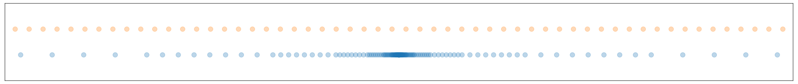

As Transformer models increase in size, the computational cost of running inference also grows. Many organisations now face the challenge of deploying state-of-the-art models in a cost-effective way.

One popular technique for doing so is **quantization** - by reducing the numerical precision of network parameters and activations, quantization aims to **increase throughput** and **decrease memory footprint**. 

Of course, this is less useful if quantizing to lower precision harms model accuracy. The first part of this blog introduces the quantization formulation, and explores techniques for minimising such degradations.

Reducing peak memory usage by quantizing from FP16 to INT8 is pretty much guaranteed. However, *achieving throughput improvements is more difficult*. The main challenge stems from overheads associated with the quantization/dequantization operations, which can mask performance gains from the blazingly fast INT8 [Tensor Core](https://www.nvidia.com/en-gb/data-center/tensor-cores/#:~:text=Tensor%20Cores%20enable%20mixed%2Dprecision,performance%20computing%20(HPC)%20tasks.) matrix multiplies. The second part of this blog explores the nuances around achieving peak performance on GPU.

# Contents

* [Part I: Accurate Quantization](#part-i-accurate-quantization)
	* [Background Concepts](#background-concepts)
	* [Specifics of INT8 GEMMs](#specifics-of-int8-gemms)
	* [Quantization-Aware Training](#quantization-aware-training)
	* [Alternatives to QAT](#alternatives-to-qat)
* [Part II: Fast GPU Quantization in Practice](#part-ii-fast-gpu-quantization-in-practice)
	* [Available Solutions](#available-solutions)
	* [Memory Layouts](#memory-layouts)
	* [Operator Fusion Implementation](#operator-fusion-implementation)
	* [INT8 GEMM Benchmarking](#int8-gemm-benchmarking)
* [Part III: FP8 & The Future of 8-bit Quantization](#part-iii-fp8--the-future-of-8-bit-quantization)
	* [Data Distribution Alignment](#data-distribution-alignment)
	* [FP8 Training](#fp8-training)
	* [cuBLASLt API](#cublaslt-api)
* [References](#references)


# Part I: Accurate Quantization


## Background Concepts

We'll start with a brief overview of quantization theory. This is not intended to be an exhaustive explanation; rather, it will serve as context for subsequent sections. For a more in-depth explanation, we recommend the blogs and papers given in the [References](#references) section [1-4].

### The Quantization Equation

In principle, we can use any function to convert from a higher-precision to lower-precision representation. But a linear function is simplest and quickest [4]:

$$Q(x)=\textrm{Int}(x/S)-Z \tag{1}$$

Here, $Q$ and $x$ are the fixed-point output and floating-point input, while $S$ and $Z$ represent the scale factor and bias. $\textrm{Int}$ is a function that rounds to the nearest integer, clipping values outside of the representable range:

$$\textrm{Int}(x)=\textrm{Clip}(\textrm{Round}(x))\tag{2}$$

After applying our lower-precision operation we return the data to its original dynamic range with dequantization: 

$$\tilde{x}=S \cdot Q(x) + Z\tag{3}$$

This method is called **uniform quantization** since the quantized values are uniformly distributed over the input space. To calculate $S$ we select a **clipping range** $[\alpha, \beta]$ and then use:

$$S=\frac{\beta-\alpha}{2^b-1}\tag{4}$$

Here, $b$ is the number of bits in our quantization scheme. GPU based quantization schemes typically enforce $\alpha=-\beta$, which is known as **symmetric quantization**. This simplifies the (de)quantization functions by setting $Z=0$[^fn1], which helps reduce the cost of the transformation [4].

It's important to note that the rounding function in Equation $(2)$ incurs a loss of information. In general, $\tilde{x}=S\cdot Q(x)+ Z\not = x$.  The value $\tilde{x}-x$ is called **quantization error**. 

### Dynamic vs Static Quantization
A key question is how to determine the clipping range - determined by $\beta$. Too small, and we’ll excessively “truncate” outlier activations and weights. Too big, and we’ll lose precision.

While model parameters can always be quantized ahead of time, its activations can either be quantized **dynamically** (with the clipping range calculated for each activation during a forward pass) or **statically** (also offline). 

Dynamic quantization tends to be more accurate but requires additional computational overhead for online scalar calibration. As a result, **we only consider static quantization on GPU** because the scalar reduction (relative to an INT8 matmul) can be costly and limit performance gains.

### Calibration

Static quantization involves obtaining activation quantization parameters by passing several batches of data through the model to measure activation distribution. This process is called **calibration**. 

There are multiple methods to derive a clipping range from these activations, such as:

* Taking the min/max value from the calibration data
* Taking some percentile (e.g 99.99%) to determine the max value
* Minimising KL Divergence between the input and quantized distributions
* Minimising the Mean-Squared Error between input and quantized distributions

The following figure [5] shows a histogram of input activations for some layer in a neural network. The vertical lines represent the maximum clipping range, $\beta$, for various calibration schemes:

.svg)

To perform calibration, one option is TensorRT’s [PyTorch Quantization Toolkit](https://github.com/NVIDIA/TensorRT/tree/master/tools/pytorch-quantization). Another is to use the `QuantStub` and `DeQuantStub` nodes from [PyTorch](https://pytorch.org/docs/stable/quantization.html) directly, to capture the relevant statistics.


### Quantization Granularity 

A final distinction to be made is how quantization parameters are shared between elements of our parameters and activations. Consider the following diagram of a matrix multiplication:


The simplest approach is to use the same scale factor for all elements of $W$ (and likewise for $X$). This is known as **per-tensor** quantization.

It’s also common to share quantization parameters between some subgroups of each input matrix. A popular option is to assign a specific scale factor to each column of $W$, referred to as **per-channel (or per-column) quantization**. This is more accurate than per-tensor quantization; using a specific scale means the error incurred in quantizing each column is lower. 


## Specifics of INT8 GEMMs

The core element of a quantized neural network is INT8 matrix multiplication. Understanding its details is crucial for an efficient implementation. This section describes these details, and serves as context for [Part II](#part-ii-fast-gpu-quantization-in-practice).

We identify two types of INT8 matmul, differentiated by their return type.

#### I8I32
Consider the following matrix multiplication:

$$Y=WX\tag{5}$$

where $X\in \mathbb{R}^{N \times d}$, $W\in \mathbb{R}^{d \times d}$, $Y\in \mathbb{R}^{N \times d}$  are the input, weight, and output tensors respectively. We omit a bias for simplicity. Consider the case where $X$ and $Y$ are **FP16**, but the matrix multiply runs in INT8. An INT8 in INT32 out (I8I32) matrix multiplication is implemented as follows:

%201.svg)

The arrows indicate a data transfer with dtype given by their colour. The square boxes indicate operations, with dtype of the return variable also given by their colour.

There are several points to note:

* The input $X$ first passes through a quantization operation, labelled Q. This performs the operation described in Equation $(1)$.
* Our weights $W$ can be quantized offline. 
* The accumulated output of the Matmul has **INT32** dtype. This is because multiplication of two signed INT8 values can be represented in INT16. Since a matmul involves the addition of several INT16 values, the accumulator must have dtype INT32 to prevent overflow.[^fn2]
* The output is passed through a dequantization op, labelled DQ. This performs the operation described in Equation $(3)$, and returns in FP16.

#### I8I8
Returning in INT8 involves an extra step:


In this **requantization** step, labelled RQ, we convert the INT32 representation back into INT8. The benefit is a reduction in the amount of data written from GPU SRAM to DRAM - and so higher performance.

We can think of requantization as first dequantizing to a floating point value, $Z$, and subsequently quantizing. The requantization scale factor combines these steps:

$$S_{RQ}=\frac{S_Z}{S_XS_W}\tag{6}$$

where $S_X$, $S_W$, and $S_Z$ are the scale factors associated with the input, weights, and intermediate variable $Z$.

#### Quantization Operation Overheads

To fully realise throughput improvements from INT8 matrix multiplications, we must reduce the cost of the Q/DQ/RQ nodes. Since these are elementwise operations, this can be achieved through [operator fusion](https://horace.io/brrr_intro.html) [6]. 
The following diagrams demonstrate this for I8I32 and I8I8. Fused operators are indicated by the dashed boxes:

.svg)

.svg)

In both cases, the Q node can sometimes be fused with a preceding operation, in this case a layernorm. 
In I8I32, we see the DQ is fused with the matrix multiply itself. This ensures the dtype of the tensor that's transferred between SRAM and DRAM is FP16 instead of INT32.
In I8I8, we see the RQ is fused with the matmul. This ensures an INT8 return type. The DQ can sometimes be fused with following ops (for example, a residual add). 

For more detail, see the section on [Operator Fusion Implementation](#operator-fusion-implementation).

## Quantization-Aware Training
So far, we have explored **Post-Training Quantization**, in which model weights are converted to INT8 after training. The degree of accuracy degradation depends upon the effectiveness of our calibration methods.

Another approach, **Quantization-Aware Training**, accounts for the impact of quantization during the training process. It can be viewed as a fine-tuning stage, adjusting model parameters to better adapt to quantization effects, thereby minimizing accuracy degradation.

Specifically, we insert nodes into the computational graph that do quantization, followed immediately by dequantization. These are labeled "QDQ" in the following diagram:


Inserting QDQ nodes in this manner is exactly equivalent to doing a quantized matrix multiply, such as the one illustrated in the [I8I32](#I8I32) section. 

We insert QDQ nodes for every quantized matmul in our network. Note that the above diagram represents I8I32 quantization. To prepare for I8I8, we insert an additional QDQ node after the matrix multiply to emulate the requantization step.

The process is then relatively straightforward: we calibrate each QDQ node, and subsequently finetune the model parameters. However, there is a complication related to backpropagation: the quantization operation is non-differentiable. In practice, we simply ignore this issue by treating  the derivative of each QDQ node as the identity function. This assumption is referred to as the **Straight-Through Estimator**.[^fn3]


## Alternatives to QAT

For situations where QAT is insufficient or undesirable, other approaches can be considered.

Recent research paper LLM.int8() [7] highlighted the existence of extreme outliers in large language models, which severely degrades accuracy when quantizing to INT8. Their solution was to decompose each matrix multiplication into 8-bit and 16-bit parts, where the wider ranged FP16 was used to preserve outliers.


This yielded promising results, but also introduced a performance overhead so is most useful for reducing peak memory.

Another paper that we found to give practical benefits was SmoothQuant [8]. They again focus on the effect of outliers but importantly, SmoothQuant can be applied **offline**, meaning there is **no performance overhead** when running inference.

The authors describe two key observations that motivate their approach:

1. The distribution of neural network weights is uniform and flat. The distributions of activations is not. This makes activations harder to quantize than weights.
2. Activation outliers appear in fixed channels.

The following diagram, taken from the original paper, illustrates these ideas for a single linear layer:


On the left-hand side, we see dramatic outlier channels in the input tensor. Given this, an obvious solution would be to apply a per-channel quantization factor. Unfortunately, this is not feasible: applying a scaling factor to individual columns of the input tensor would not factor out nicely in the output, meaning we could not apply dequantization.

Other works have instead used a per-token quantization granularity. This can improve accuracy slightly, but does not solve the issue of fixed-channel outlier values. 

Instead, SmoothQuant aims to "migrate" the quantization difficulty from activations to weights. It does so by scaling each channel of the activations by a "smoothing factor". To ensure mathematical equivalence, we must scale each token of the weight tensor by the same amount in the opposite direction.

Mathematically, this is given by:

$$Y = (X\textrm{diag}(s)^{-1})\cdot(\textrm{diag}(s)W)=\hat{X}\hat{W}\tag{7}$$

where $s\in \mathbb{R}^d$  is our smoothing factor. Here's a diagram, again taken from the paper:


All that remains is how to determine $s$. Since quantization is easiest when all channels have the same maximum value, one possibility is:

$$s_j=\max(|X_j|)\tag{8}$$
where $j$ is the channel index. This ensures that all channels would have the same maximum value (of 1). However, this may push too much of the quantization difficulty to the weights, meaning we harm quantization accuracy.

The other extreme is:

$$s_j = 1 / \max({|W_j|})\tag{9}$$
To control the migration strength, the authors propose combining each of these equations by introducing a hyperparameter, $\alpha \in [0,1]$:

$$s_j=\frac{\max(|X_j|)^\alpha}{\max({|W_j|})^{1-\alpha}}\tag{10}$$

$\alpha=1$ corresponds to migrating all difficulty to the weights. $\alpha=0$ migrates all difficulty to the activations. In general, setting $\alpha$ to be between 0.5 and 0.9 achieves good performance.

It's important to reiterate that this smoothing process can be applied **offline**. For the weights, this is trivial. For the activations, we exploit the fact that GEMM operations in a transformer block often follow a layernorm. Combining the multiplication by $\textrm{diag}(s)^{-1}$  into the layernorm parameters means that it too can be done offline.

A consequence of this is that SmoothQuant can only be applied (without performance overhead) to matrix multiplications that follow an operation which can accommodate a smoothing factor into its parameters, such as LayerNorm. The diagram below indicates the relevant matrix multiplies in a standard transformer block:

.svg)


# Part II: Fast GPU Quantization in Practice

In order to run INT8 GEMMs efficiently on CUDA GPUs we must execute the operation against INT8 Tensor Cores. These were first introduced with the Turing architecture (compute capability 7.0+). INT4 and INT1 Tensor Cores also exist but have been deprecated in future architectures (see the figure below, taken from [Wikipedia](https://en.wikipedia.org/wiki/Ampere_(microarchitecture))). We therefore focus on INT8 quantization.


Executing against Tensor Cores can be achieved by running the `mma.sync.aligned.m8n32k16.row.col.s32.s8.s8.s32` [PTX](https://en.wikipedia.org/wiki/Parallel_Thread_Execution) instruction, or calling `wmma::mma_sync` at the CUDA level. However, both approaches require careful management of data movement and layouts to maximize Tensor Core throughput. 

Thankfully, these lower level details are abstracted away by the **cuBLASLt** `cublasLtMatmul`  and **[CUTLASS](https://github.com/NVIDIA/cutlass)** `device::Gemm` APIs, both of which support IMMA (integer matrix multiply accumulate).

## Available Solutions

While integration with these APIs is currently not supported natively in PyTorch, there are other libraries available such as [**torch-int**](https://github.com/Guangxuan-Xiao/torch-int) (SmoothQuant [8]) and [**bitsandbytes**](https://github.com/TimDettmers/bitsandbytes) (LLM.int8() [7]) which expose Python bindings to the underlying cuBLASLt/CUTLASS calls. Microsoft's **ZeroQuant** [9] also leverage CUTLASS, but wrappers for their INT8 kernels are not open source.

Although these libraries offer flexibility and easy integration, they don't currently provide performance gains and are consistently slower than FP16. This is due to prioritizing accuracy and memory savings or lacking efficient quantization implementations.

In contrast, fully-fledged inference frameworks such as [TensorRT](https://github.com/NVIDIA/TensorRT) (TRT) and [FasterTransformer](https://github.com/NVIDIA/FasterTransformer) do achieve performance gains. They also manage the complexity of fusing quant & dequant nodes with adjacent operators. This is appealing for common Transformer types such as BERT and GPT, for which they have been heavily optimised. However, the rigid assumptions made by these libraries make them less suitable for more unusual architectures. 

Specifically, whilst TRT supports generic [ONNX](https://onnx.ai/) models, to achieve peak performance in their BERT implementation they rewrite the model using the TRT Network Definition API, and utilize custom plugins (such as fused multi-headed attention). This level of manual intervention means the benefits of a more generic model export + inference runtime are diminished. FasterTransformer's INT8 compatible models have been rewritten in C++ in order to leverage the best performance by using the non-standard interleaved data layout required by cuBLASLt. This limits the extensibility of existing INT8 model implementations for novel architectures.

Ideally, we can achieve the performance of these inference frameworks while retaining the flexibility of [**torch-int**](https://github.com/Guangxuan-Xiao/torch-int) and [**bitsandbytes**](https://github.com/TimDettmers/bitsandbytes). The remainder of this blog concentrates on achieving both good INT8 performance _and_ flexibility. 

## Memory Layouts

As previously suggested, ensuring that input and weight matrices satisfy specific memory layout requirements is essential for INT8 GEMM performance. By default, all PyTorch operators expect a [row-major](https://en.wikipedia.org/wiki/Row-_and_column-major_order) ordering for input and outputs tensors. Ideally, we'd use the same layout for our INT8 matmul to avoid conversion overhead.

Unfortunately, this is not the case with cuBLASLt which operates on **column major** by default. The `cublasLtMatmul` API does support a row major input tensor with column major weight tensor (and we can transpose the weight tensor offline), but the output is returned in column major. In other words, input/weight/output = `ROW`/`COL`/`COL`. CUTLASS  goes further and supports `ROW`/`COL`/`ROW` out of the box, which makes it a great option for PyTorch integrations.

While these options are already faster than FP16, performance can be further improved by using the `COL32`/`CUBLASLT_ORDER_COL32_2R_4R4`/`COL32` layout for input tensors. This layout is very non-standard but can significantly boost performance.

`COL32` is an interleaved layout which can be interpreted as row-major ordered but in blocks of 32 columns. CUTLASS supports this by specifying `cutlass::layout::ColumnMajorInterleaved<32>`. `CUBLASLT_ORDER_COL32_2R_4R4` is even more exotic and is best explained visually. 

The diagrams below depict 32x64 matrices where each numerical value represents the memory address offset for that element.

#### Row major (CUBLASLT_ORDER_ROW)


#### Column major (CUBLASLT_ORDER_COL)


#### Column 32 (CUBLASLT_ORDER_COL32)


#### Column Turing (CUBLASLT_ORDER_COL4_4R2_8C)


#### Column Ampere (CUBLASLT_ORDER_COL32_2R_4R4)


Zooming in on the first 16 x 4 elemnts gives a clearer picture of the layout pattern:

#### Row major (CUBLASLT_ORDER_ROW)


#### Column major (CUBLASLT_ORDER_COL)


#### Column 32 (CUBLASLT_ORDER_COL32)


#### Column Turing (CUBLASLT_ORDER_COL4_4R2_8C)


#### Column Ampere (CUBLASLT_ORDER_COL32_2R_4R4)


While `COL32` is the most performant layout, it comes with an associated cost of layout conversion. This may cancel out any gains from the reduced precision matmul. Therefore, we must decide to either:

1. Persist the data in the required format (à la [Faster Transformer](#Available%20Solutions)).
2. Hide the cost via kernel fusion. 

The latter approach is similar to how quantization/dequantization overhead is typically hidden, which is discussed next.

## Operator Fusion Implementation
As described in the [Quantization Operation Overheads](#quantization-operation-overheads) section, kernel fusion is essential to developing a quantized model with superior throughput to FP16. To avoid the pain of writing CUDA, these can be implemented using OpenAI's [Triton Language](https://github.com/openai/triton)[10]. This section provides a short example.

Consider the code below. It demonstrates a modified Layernorm kernel, based upon that given in the [Triton documentation](https://triton-lang.org/master/getting-started/tutorials/05-layer-norm.html). Besides performing the layernorm operation, it also:

* Fuses a quantization op, `_quant()`, and
* Converts data layout from row-major to COL32 (see `cols_out`).

```python
"""
Example Triton kernel that implements fused Layenorm + Quantization.
Also performs layout conversion from row-major to COL32.
The kernel code is adapted from the Triton Lang tutorial.
See https://triton-lang.org/master/getting-started/tutorials/05-layer-norm.html
"""
import triton
import triton.language as tl

@triton.jit
def layernorm_Q(
	Input,
	Output,
	Weight,
	Bias,
	quant_scale,
	stride, # Stride between rows
	M, # Number of rows
	N, # Number of columns
	eps: tl.constexpr,
	BLOCK_SIZE: tl.constexpr,
):
	stride_out = 32 # Because COL32

	# Position of elements processed by this program
	row = tl.program_id(0)
	Output += row * stride_out
	Input += row * stride

	# Layenorm: Compute mean
	mean = 0
	_mean = tl.zeros([BLOCK_SIZE], dtype=tl.float32)
	cols = off + tl.arange(0, BLOCK_SIZE)
	a = tl.load(Input + cols, mask=cols < N, other=0.0,    eviction_policy="evict_last").to(tl.float32)
	_mean += a
	mean = tl.sum(_mean, axis=0) / N

	# Layernorm: Compute variance
	_var = tl.zeros([BLOCK_SIZE], dtype=tl.float32)
	cols = off + tl.arange(0, BLOCK_SIZE)
	a = tl.load(Input + cols, mask=cols < N, other=0.0, eviction_policy="evict_last").to(tl.float32)
	a = tl.where(cols < N, a - mean, 0.0)
	_var += a * a
	var = tl.sum(_var, axis=0) / N
	rstd = 1 / tl.sqrt(var + eps)

	# Layernorm: Multiply by weight, and add bias
	cols = off + tl.arange(0, BLOCK_SIZE)
	mask = cols < N
	weight = tl.load(Weight + cols, mask=mask)
	bias = tl.load(Bias + cols, mask=mask)
	a = tl.load(Input + cols, mask=mask, other=0.0, eviction_policy="evict_first").to(tl.float32)
	a_hat = (a - mean) * rstd
	y = a_hat * weight + bias

	# Quantize
	pos_clamps = tl.zeros([BLOCK_SIZE], dtype=tl.float32) + 127
	neg_clamps = tl.zeros([BLOCK_SIZE], dtype=tl.float32) - 127
	y = (y * quant_scale).to(tl.float32)
	y = tl.libdevice.rint(y)
	y = tl.where(y > 127, pos_clamps, y)
	out = tl.where(y < -127, neg_clamps, y)

	# Pointer arithmetic for Row-major --> COL32	
	cols_out = cols // stride_out * (stride_out * M) + (cols % stride_out)
	
	# Store output
	tl.store(Output + cols_out, out, mask=mask)
```


## INT8 GEMM Benchmarking

We now examine peformance numbers for various flavours of INT8 GEMM. For these benchmarks, we wrap the C++ APIs for cuBLASLt and CUTLASS as PyTorch extensions.

Benchmarks were run on a T4 GPU with input tensors of shape `[2048, 1920]` and `[1920, 1920]`. While mileage may vary for different input shapes, the following conclusions were found to be consistent over a variety of shapes/sizes.

For a detailed guide to timing CUDA kernels with PyTorch, see this [previous blog](https://www.speechmatics.com/company/articles-and-news/timing-operations-in-pytorch). 

###  INT8 vs INT32 output precision

$$D=\alpha AB+\beta C\tag{11}$$

One important factor which determines INT8 GEMM performance (formula above) is the return type. The matrix multiplication will always have INT8 dtype for matrices $A$ and $B$, which then accumulate in INT32 within the kernel. But we need to decide whether output $C$ should be INT8 or INT32.

INT32 return type will be slower as four times as much data is written out (and read into the next kernel).

In comparison, INT8 return type is faster but there is a trade-off: accuracy will be worse, as we need to requantize the output from INT32 to INT8 within the kernel. More information on this can be found in [earlier sections](#I8I8). 

The measured throughput figures are shown below:

|       Kernel       | Time (ms) | vs. FP16 |
|:------------------:|:---------:|:--------:|
| F16F16 (Torch)  |    600    |   1.0x   |
| I8I32 (cuBLASLt) |    364    |   1.65x  |
| I8I8 (cuBLASLt) |    308    |   1.95x  |

Overall, the decision is very much dependent on the accuracy/performance trade-off, as well as the specifics of the model architecture.

### FP16 output precision

We previously touched upon the fact that INT32 return type requires dequantizing outside of the matmul. [Performance can be improved by fusing the dequant with the matmul itself, and returning FP16 outputs.](#^091c98) 

We can achieve this for free by using the GEMM `α` parameter to dequantize the outputs (the same way that we requantize INT8 outputs). However, this only works if we apply [per-tensor](#Quantization%20Granularity) quantization, where the dequantization parameter is a single scalar.

What if we require **per-channel** quantization? In this case, CUTLASS comes to the rescue by allowing the definition of a custom epilogue function, which loads the vector based scalar. This is applied after the matrix multiplication, in a single fused kernel. The GEMM + epilogue definition is expanded to:

$$D=f_2(f_1(\alpha AB+\beta C, d))\tag{12} $$
The epilogue format comes from `EpilogueWithBroadcast` which applies a [binary operation](https://github.com/NVIDIA/cutlass/blob/master/include/cutlass/epilogue/thread/linear_combination_bias_elementwise.h#L215)`f1` between the matmul output and a column-wise broadcasted vector `d`, followed by an optional elementwise op `f2`.

`f1` might typically be a bias addition followed by an activation function (e.g. ReLU) for in `f2`. In our case we want `f1` to be a multiplication with the dequantization scalar and `f2` to be the identity. The epilogue is then plugged into `gemm::device::GemmUniversalWithBroadcast`.

|       Kernel       | Time (ms) | vs. FP16 |
|:------------------:|:---------:|:--------:|
| F16F16 (Torch)  |    600    |   1.0x   |
| I8I32 (CUTLASS) |    461    |   1.30x  |
| I8F16 (CUTLASS) |    438    |   1.37x  |

Whilst there might not be huge throughput improvements from FP16 output for the matmul itself, there are other performance benefits to the next kernel in the sequence (following the matmul):

- 50% less data loaded (now FP16 instead of INT32)
- Avoid fusion requirement with the dequantize operator (simpler)
- Avoid loading the dequantization vector (CUTLASS hides the cost of this load by pipelinining it with the matmul computation)

### Memory layout

Lastly, we examine the effect of memory layout on matmul performance:

|       Kernel       | Time (ms) | vs. FP16 |
|:------------------:|:---------:|:--------:|
| F16F16 Row major (Torch)  |    600    |   1.0x   |
| I8I8 Row major  (cuBLASLt) |    365    |   1.64x  |
| I8I8 COL32 (cuBLASLt) |    308    |   1.95x  |

As expected, COL32 is most performant. 


# Part III: FP8 & The Future of 8-bit Quantization

The arrival of Nvidia's Hopper/Lovelace architectures brings support for a new floating point datatype - FP8. This is available in two formats:

- **E5M2** - 5 exponent bits and 2 mantissa bits - larger dynamic range
- **E4M3** - 4 exponent bits and 3 mantissa bits - higher precision

Choosing an FP8 quantization format can have both accuracy and performance benefits.

## Data Distribution Alignment
When quantizing from FP16 to INT8, we not only reduce the range and number of values that can be represented, but also change the underlying distribution. Most of the tensors we want to quantize will be normally distributed. This mirrors the representable floating point values - and is in contrast to the fixed point integers which provides a uniform distribution. Research already suggests that we can remove/reduce the need for QAT by using FP8 over INT8 [11],[12]. 

The image below illustrates the distribution of representable values for INT8 (top) and FP8 (bottom). These have been scaled to have the same min/max. 



## FP8 Training
[Quantization-Aware Training](#quantization-aware-training) results in decreased training throughput, and approximate gradients (due to the Straight-Through Estimator). In contrast, FP8 tensor cores combined with libraries like [Transformer Engine](https://github.com/NVIDIA/TransformerEngine) pave the way for accurate and performant 8-bit training.

## cuBLASLt API
Although FP8 tensor cores have the same theoretical throughput as INT8, changes to the `cublasLtMatmul` API for FP8 means we can avoid a lot of the pain associated with achieving peak 8-bit performance. Specifically:

- [Input requires Row Major memory layout](https://docs.nvidia.com/cuda/cublas/index.html#cublasltmatmul) rather than COL32 - so we can bypass this conversion overhead
- The [GEMM API](https://docs.nvidia.com/cuda/cublas/index.html#bit-floating-point-data-types-fp8-usage) now accepts additional scalars which are multiplied with the input/output tensors. This can be used to fuse quantize/dequantize with the matmul itself.

Both of these changes mean we can consider each matmul in isolation, without having to apply fusions with adjacents operations. 

# References

1. Subramanian, Suraj, et al. "[Practical Quantization in PyTorch](https://pytorch.org/blog/quantization-in-practice/)" (2022).
2. Mao, Lei. "[Quantization for Neural Networks](https://leimao.github.io/article/Neural-Networks-Quantization/)" (2020).
3. [PyTorch Docs - Quantization](https://pytorch.org/docs/stable/quantization.html#model-preparation-for-eager-mode-static-quantization).
4. Gholami, Amir, et al. "[A survey of quantization methods for efficient neural network inference.](https://arxiv.org/pdf/2103.13630.pdf)" _arXiv preprint arXiv:2103.13630_ (2021).
5. Wu, Hao, et al. "[Integer quantization for deep learning inference: Principles and empirical evaluation.](https://arxiv.org/pdf/2004.09602.pdf)" _arXiv preprint arXiv:2004.09602_ (2020).
6. He, Horace. "[Making Deep Learning Go Brrrr From First Principles](https://horace.io/brrr_intro.html)" (2022).
7. Dettmers, Tim, et al. "[Llm. int8 (): 8-bit matrix multiplication for transformers at scale.](https://arxiv.org/pdf/2208.07339.pdf)" _arXiv preprint arXiv:2208.07339_ (2022).
8. Xiao, Guangxuan, et al. "[Smoothquant: Accurate and efficient post-training quantization for large language models.](https://arxiv.org/pdf/2211.10438.pdf)" _arXiv preprint arXiv:2211.10438_ (2022).
9. Yao, Zhewei, et al. "[ZeroQuant: Efficient and affordable post-training quantization for large-scale transformers.](https://proceedings.neurips.cc/paper_files/paper/2022/file/adf7fa39d65e2983d724ff7da57f00ac-Paper-Conference.pdf)" _Advances in Neural Information Processing Systems_ 35 (2022): 27168-27183.
10. Tillet, Philippe, Hsiang-Tsung Kung, and David Cox. "[Triton: an intermediate language and compiler for tiled neural network computations.](http://www.eecs.harvard.edu/~htk/publication/2019-mapl-tillet-kung-cox.pdf)" _Proceedings of the 3rd ACM SIGPLAN International Workshop on Machine Learning and Programming Languages_ (2019).
11. Kuzmin, Andrey, et al. "[FP8 Quantization: The Power of the Exponent.](https://arxiv.org/pdf/2208.09225.pdf)" _arXiv preprint arXiv:2208.09225_ (2022).
12. Micikevicius, Paulius, et al. "[FP8 formats for deep learning.](https://arxiv.org/pdf/2209.05433.pdf)" _arXiv preprint arXiv:2209.05433_ (2022).


[^fn1]: The idea that setting $\alpha=-\beta$  implies that $Z=0$ is non-trivial. It holds true because we enforce two conditions for our quantization scheme: the first is that $\beta$ and $\alpha$ map to the maximum and minimum values of our quantized representation respectively, for instance $127$ and $-128$ in INT8; the second is that $Q(0)=0$. For more detail, see [Lei Mao's blog](https://leimao.github.io/article/Neural-Networks-Quantization/) [2].
[^fn2]: It's still theoretically possible to encounter an overflow if a large number of INT16 values are added together. However, this is unlikely in practice and the use of an INT32 accumulator is sufficient.
[^fn3]: Since the Straight-Through Estimator totally ignores each QDQ node, the [TensorRT PyTorch Quantization docs](https://docs.nvidia.com/deeplearning/tensorrt/pytorch-quantization-toolkit/docs/userguide.html#quantization-aware-training) choose not to use the term "Quantization-Aware Training". They argue that "if anything, it makes training being 'unaware' of quantization".
